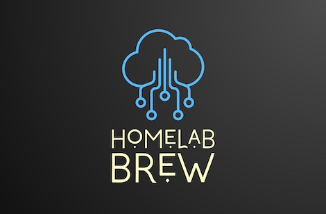

# HomeLab Brew



Docker compose setup for a Homelab Server (Raspberry Pi, NUC...)

---

## Architecture (TO BE ADDED)

---

## Prerequisites (tested on)

- Raspberry Pi 2-4
- Class10 Micro SD Card with minimum 16GB, but suggested 32GB storage capacity
- External HDD
- LAN cable (Wifi could be ok, but if you plan with higher traffic, I suggest LAN cable)
- Optional passive cooling case

OR

- Intel NUC
- 16-32GB DDR4 RAM
- 1TB NVMe SSD
- External HDD
- LAN cable (Wifi could be ok, but if you plan with higher traffic, I suggest LAN cable)

---

## Installation

- ### Raspberry Pi

  - Install Raspberry Pi OS based on this instruction  
  (I used the 64bit lite image for my Raspberry Pi 4 4GB version):  
  <https://www.raspberrypi.com/documentation/computers/getting-started.html#using-raspberry-pi-imager>
  - Open the following ports in your router settings towards Raspberry Pi: 22, 80, 443
  - Format the HDD to ext4 filesystem:  
  <https://www.tecmint.com/create-new-ext4-file-system-partition-in-linux/>
  - Setup the auto mount of the external HDD with fstab:  
  <https://www.shellhacks.com/raspberry-pi-mount-usb-drive-automatically/>
  - Install docker:  
  <https://www.simplilearn.com/tutorials/docker-tutorial/raspberry-pi-docker>
  - Install docker-compose:  
  <https://dev.to/elalemanyo/how-to-install-docker-and-docker-compose-on-raspberry-pi-1mo>
  - Configure your router to have the same internal IP for your Raspberry Pi everytime (Manual IP of device to DHCP list in router)
  - Disable userland-proxy:  
    1. Create/edit ```/etc/docker/daemon.json```
    2. Add this:  

        ```yaml
        {
          "userland-proxy": false,
          "iptables": true
        }
        ```

    3. Restart docker: ```sudo systemctl restart docker```
    4. If not done automatically, it may also be necessary to run:  
    ```/sbin/sysctl net.ipv4.conf.docker0.route_localnet=1```

- ### Intel NUC

  - Install Ubuntu Server to your NUC as per this guide:  
  <https://swati-goyal.medium.com/how-to-setup-nuc-with-ubuntu-server-e15485fa1323>
  - Install Docker engine to your Ubuntu Server:  
  <https://docs.docker.com/engine/install/ubuntu/>
  - Optionally add Desktop GUI (not needed normally, it is your preference if you are more comfortable with it):  
  <https://phoenixnap.com/kb/how-to-install-a-gui-on-ubuntu>

- ### Steps for both RPi and NUC
  
  - Make sure to have DNS servers are permanently present in ```/etc/resolv.conf```:
    - ```sudo apt install resolvconf```
    - Open ```/etc/resolvconf/resolv.conf.d/base``` and add the following lines:  

      ```config
      nameserver 8.8.8.8
      nameserver 8.8.4.4
      ```

    - ```sudo resolvconf -u```
    - ```systemctl status systemd-resolved.service```
    - ```systemctl enable systemd-resolved.service```
    - Try ```resolvectl status```
  - Free up port 53 for Pi-hole:
    - ```sudo systemctl stop systemd-resolved```
    - Edit ```/etc/systemd/resolved.conf```
      - ```DNSStubListener=no```
    - ```sudo ln -sf /run/systemd/resolve/resolv.conf /etc/resolv.conf```
  - You might increase the default swap size from 100MB to 1GB:  
  <https://nebl.io/neblio-university/enabling-increasing-raspberry-pi-swap>

---

## Preparation

(The repo contains 5 stack, each stack contains it's config and .env files.)

- Clone the repository
- Create the following folders from the ```.env``` file of each of the stacks (core, extended, media, grafana, other):
  - ```HDD_PATH```
  - ```HDD_PATH/_backup```
  - ```HDD_PATH/_cache```
  - ```HDD_PATH_SHARED```
  - ```CONFIG_PATH``` (each containers config is stored inside the stack folder)
  - ```JELLYFIN_HDD```
  - ```JELLYFIN_CACHE```
  - ```JELLYFIN_METADATA```
  - ```JELLYFIN_TRANSCODE_CACHE```
  - ```HDD_PATH_SHARED/downloads```
  - ```HDD_PATH_SHARED/nextcloud```

---

## Configure the environment

- Setup Dynamic DNS: Register and login to <https://www.dynu.com/en-US/ControlPanel/DDNS> or <https://www.duckdns.org/>, and add a subdomain you wish
- ```sudo chmod 600 docker_compose/core_stack/letsencrypt/acme.json```
- Update ```.env``` file based on the comments in the file
- Update ```${CONFIG_PATH}/core_stack/authelia/configuration.yml``` based on the comments in the file
- Update ```${CONFIG_PATH}/core_stack/authelia/users_database.yml``` based on the comments in the file
- Update ```${CONFIG_PATH}/core_stack/traefik/rules.toml``` based on the comments in the file
- Update ```${CONFIG_PATH}/grafana_stack/grafana/provisioning/datasources/datasource.yml``` based on the comments in the file
- Update ```${CONFIG_PATH}/grafana_stack/grafana/config.monitoring``` based on the comments in the file
- Update ```${CONFIG_PATH}/core_stack/homepage/bookmarks.yml``` based on the comments in the file
- Update ```${CONFIG_PATH}/core_stack/homepage/services.yml``` based on the comments in the file
- Update ```${CONFIG_PATH}/core_stack/homepage/settings.yml``` based on the comments in the file
- Update ```${CONFIG_PATH}/core_stack/homepage/widgets.yml``` based on the comments in the file
- Update ```${CONFIG_PATH}/extended_stack/ntfy/server.yml``` based on the comments in the file
  - Update ```base-url:```
- ```sudo docker compose up -d --force-recreate --remove-orphans```
- You can reach each container with the address defined in the ```.env``` files of the stack folders

---

## Configure the containers

**- Loki:**  
You have to configure docker to stream it's container logs into Loki directly

- Install Loki Docker Driver:
  ```docker plugin install grafana/loki-docker-driver:latest --alias loki --grant-all-permissions```
- Edit Docker daemon.json:
  ```sudo nano /etc/docker/daemon.json```
- Add the following lines and save:

  ```config
  {
    "log-driver": "loki",
    "log-opts": {
        "loki-url": "http://localhost:3100/loki/api/v1/push",
        "loki-batch-size": "400"
    }
  }
  ```

**- Jellyfin:**  
(These steps are must, if you want to save space during Jellyfin streaming with transcoding, cache and metadata, since it is generating huge files, so I suggest to put it into the HDD, not to SD card where the default config sets)

- Set Jellyfin custom transcode cache path to your prevously set in the ```.env```: ```Settings --> Playback --> Transcode path``` (dont forget to click on save after)
- Set Jellyfin custom cache path to your prevously set in the ```.env```: ```Settings --> General --> Cache path``` (dont forget to click on save after)
- Set Jellyfin custom metadata path to your prevously set in the ```.env```: ```Settings --> General --> Metadata path``` (dont forget to click on save after)

**- Pi-hole:**  

- Add your Rasbpberry Pi's IP address as a primary DNS server to your router configuration to make sure that every of your device connected to the router will be ad-free
  - Optional: update Pi-hole ad-list with additional database URLs

**- Ntfy:**  

- Setup notifications channels in the self-hosted URL you provided in the ```.env``` file
- [Add users](https://docs.ntfy.sh/config/#access-control)
  - ```sudo docker exec -it ntfy /bin/sh```
  - ```ntfy user add USERNAME```
  - ```ntfy user add --role=admin ADMINUSERNAME```
- Download app for iOS or Android to get push notifications
- After setting up the topic, lets try:
  - ```curl --user "username:password" -d "Hey there" https://ntfy.yourdomain.example.com/test```

**- Mealie:**  

- First time login info (Highly suggesting to change it after the first login):
  - Username: changeme@email.com
  - Password: MyPassword

**- Ollama:**  

- Connect to Ollama docker container from command line:
  - ```docker exec -it ollama sh```
  - Enter command to download models from [Ollama website](https://ollama.com/search), e.g.:
    - ```ollama run deepseek-r1```

---

## Containers used

- <https://hub.docker.com/r/traefik/whoami>
- <https://hub.docker.com/r/dperson/samba>
- <https://hub.docker.com/r/vladgh/minidlna>
- <https://hub.docker.com/r/linuxserver/wikijs>
- <https://hub.docker.com/r/linuxserver/librespeed>
- <https://hub.docker.com/r/hurlenko/filebrowser>
- <https://hub.docker.com/r/linuxserver/jellyfin>
- <https://hub.docker.com/r/linuxserver/dokuwiki>
- <https://hub.docker.com/r/linuxserver/duckdns>
- <https://hub.docker.com/r/containrrr/watchtower>
- <https://hub.docker.com/r/linuxserver/qbittorrent>
- <https://hub.docker.com/r/pihole/pihole>
- <https://hub.docker.com/r/linuxserver/heimdall>
- <https://hub.docker.com/_/traefik>
- <https://hub.docker.com/r/portainer/portainer-ce>
- <https://hub.docker.com/r/selfhostedpro/yacht>
- <https://hub.docker.com/r/prom/prometheus>
- <https://hub.docker.com/r/prom/node-exporter>
- <https://hub.docker.com/r/grafana/grafana>
- <https://hub.docker.com/r/grafana/loki>
- <https://hub.docker.com/r/grafana/promtail>
- <https://hub.docker.com/r/grafana/loki-docker-driver>
- <https://github.com/benphelps/homepage/>
- <https://hub.docker.com/r/linuxserver/duplicati>
- <https://hub.docker.com/r/authelia/authelia>
- <https://hub.docker.com/r/binwiederhier/ntfy>
- <https://uptime.kuma.pet/>
- <https://hub.docker.com/r/linuxserver/plex>
- <https://hub.docker.com/r/tautulli/tautulli>
- <https://hub.docker.com/r/linuxserver/calibre-web>
- <https://hub.docker.com/r/linuxserver/nextcloud>
- <https://hub.docker.com/r/hkotel/mealie>
- <https://hub.docker.com/r/excalidraw/excalidraw>
- <https://hub.docker.com/r/bxnxm/micros-gateway/>
- <https://github.com/BxNxM/micrOS/>
- <https://github.com/homebridge/docker-homebridge>
- <https://hub.docker.com/r/ollama/ollama>
- <https://github.com/open-webui/open-webui/pkgs/container/open-webui>

---

## Useful links

- <https://www.dynu.com/en-US/ControlPanel/DDNS>
- <https://www.duckdns.org/>
- <https://github.com/vegasbrianc/docker-traefik-prometheus/tree/master>
- <https://gethomepage.dev/>
- <https://github.com/marcogreiveldinger/videos/tree/main/authelia>
- <https://technotim.live/posts/authelia-traefik/>
- <https://technotim.live/posts/grafana-loki/>
- <https://www.youtube.com/@TechnoTim>
- <https://www.youtube.com/@christianlempa>
- <https://ntfy.sh/>
- <https://tautulli.com/>
- <https://github.com/homebridge/homebridge/wiki/Install-Homebridge-on-Docker>
- <https://ollama.com/search>
